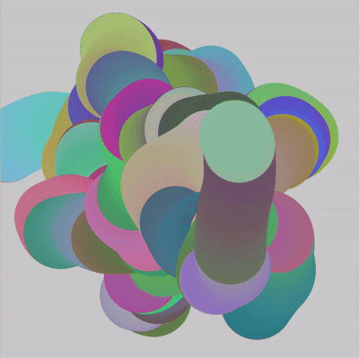

# Major_Individual

## Instructions on How to Interact with the Work
- **Load the Page** Simply load the page, and the animation will begin automatically.

- **Resize the Window** Try resizing the browser window to see how the layout adapts and the Perlin noise-driven animations continue smoothly.

## Individual Approach to Animating the Group Code
- **Animation Driver: Perlin Noise**
I chose to drive my individual code using Perlin noise. Perlin noise is a gradient noise function that produces a more natural, continuous variation compared to traditional random noise. This choice creates smooth transitions and visually appealing effects that are less jarring than pure randomness.

## Animated Properties
- **Different Color Squares** The colors of the squares change dynamically based on Perlin noise. This introduces a smooth, organic variation in their appearance, simulating a pulsing effect.

- **Yellow Lines** The widths of the yellow lines vary dynamically based on Perlin noise. This adds a sense of fluidity and motion to the otherwise static lines.

- These animated properties make the work unique from other group members by focusing on smooth, continuous color changes and line width variations driven by Perlin noise.

## Inspiration
I was inspired by visualizations that use Perlin noise to create organic, flowing patterns. Images and gifs that show gradient transitions and smooth morphing shapes influenced my submission.

[link of perlin noise color changing](https://celiawrite.medium.com/learn-apply-p5-js-b927e254cf11)

## Technical Explanation
- **Perlin Noise-Driven Color Changes**

The Perlin noise function is used to generate a smooth, continuous value for each square. This value is then mapped to a color range, creating a dynamic color-changing effect.

- **Perlin Noise-Driven Line Width Changes**

Similarly, Perlin noise is used to determine the width of each yellow line. This value is mapped to a range of acceptable line widths, resulting in smooth, dynamic variations in line width.